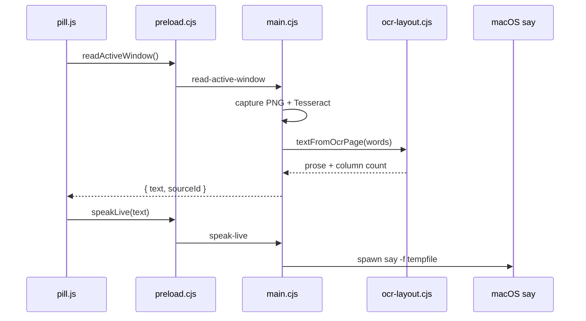

# About the Read to Me architecture

## What this is

Read to Me is a Mac desktop companion. A small always-on-top pill sits over Preview, a browser, or any other window. Tap Read. The app captures that window, rebuilds the page text with OCR, and speaks it through live macOS `say`.

It is not a website you paste into. The Next.js tree under `src/` is an earlier experiment and is frozen.

## Core loop

```
frontmost window → PNG capture → Tesseract words → column reflow → live say
```

While speech is running, a dim reading band overlays the target window. Scroll-follow peeks at the page. After the view settles, it OCRs again and continues from the newly visible text.

## Key pieces

**Pill renderer.** `desktop/renderer/pill.js` owns Read, Pause, Resume, Stop, the window picker, and scroll-follow timers. It calls `window.readToMe.*` and `ReadToMeSpeech`.

**Speech session.** `desktop/renderer/speech.js` arms one speak loop at a time. Live `say` is the default. File and neural chunk playback remain as fallbacks.

**Main process.** `desktop/main.cjs` lists windows, scores the frontmost PDF-like target, captures a PNG, runs Tesseract, shows the highlight overlay, and scrolls the target with AppleScript.

**OCR layout.** `desktop/lib/ocr-layout.cjs` turns word boxes into speech text. Two-column pages read left column top to bottom, then right. Curly quotes become ASCII so `say` does not turn "don't" into "don t".

**TTS.** `desktop/lib/tts.cjs` starts `say -r 185 -f <tempfile>` without `-v` on macOS, so Spoken Content supplies the voice. Optional cloud neural TTS runs only when a gateway key is set.

**Name contract.** `desktop/api-contract.json` is the vocabulary for IPC methods, TTS exports, DOM ids, and engine strings. `desktop/scripts/check-api-contract.cjs` fails the process if a layer drifts.

## How Read works

1. The user taps Read, or picks a window with the picker.
2. `pill.js` calls `readActiveWindow` or `readWindowById`.
3. `main.cjs` captures the window, prepares the image, and OCRs it.
4. `textFromOcrPage` rebuilds reading order.
5. `speech.speakLive` asks main to spawn `say`.
6. Follow starts. Peek captures compare luminance. A large still shift triggers a new OCR. Stop clears follow and kills `say`.



## Where things live

| Path | Role |
| --- | --- |
| `desktop/` | The product |
| `desktop/main.cjs` | Capture, OCR worker, windows, highlight, scroll |
| `desktop/lib/ocr-layout.cjs` | Reading order (Linux-testable) |
| `desktop/lib/tts.cjs` | Live `say` and fallbacks (reflow/chunk Linux-testable) |
| `desktop/renderer/pill.js` | Follow state and playback UI |
| `desktop/api-contract.json` | Frozen names |
| `src/` | Frozen web experiment |
| `run.sh` / `update-and-run.sh` | Mac launch helpers |

## Gotchas

Identifier drift has already broken speech. Change names in the contract and every consumer together.

`app.on("window-all-closed")` quits only off Mac. The app still starts on Linux. Unit tests never load Electron.

`desktop/renderer/speech.js` still contains `speechSynthesis`. `pill.js` calls `speech.speakLive` first. If live `say` fails on Mac, `synthesizeSpeechChunk` returns empty `parts`, so the fallback is browser TTS, not neural and not a WAV file.

Highlight and Page Down ignore the Electron `sourceId` the pill passes. They use the frontmost external app from AppleScript. Capture uses `source.id`. Two Preview windows can OCR one frame and paint the band on the other.

Page Down is a no-op while the pill holds focus. Scroll-follow after the user scrolls is the path that actually advances.

`synthesize-speech` IPC is live. If `AI_GATEWAY_API_KEY` or `OPENAI_API_KEY` is set, that handler may send page text to the cloud. Read does not call it.

Follow state in `pill.js` is a handful of timers and generation counters (`speakSession`, `followGeneration`, `followTargetId`). Those exist because an older loop kept talking after retarget. Do not start a second speak loop without bumping `speakSession`. `stopFollow()` must not bump `speakSession`. `startFollow()` calls it mid-Read.

The last Mac report was speech stopping after a few words. The fix is `9d57955`. Nobody retested it here.

`update-and-run.sh` fast-forwards whatever branch the clone is on. It does not pin a Cursor feature branch.

The web voice types in `src/lib/voice/types.ts` do not apply to the desktop path. Desktop live speech is `macos-say-live`.

## Privacy

The system-voice path keeps window frames on-device. If `AI_GATEWAY_API_KEY` or `OPENAI_API_KEY` is set, page text may go to cloud TTS.
